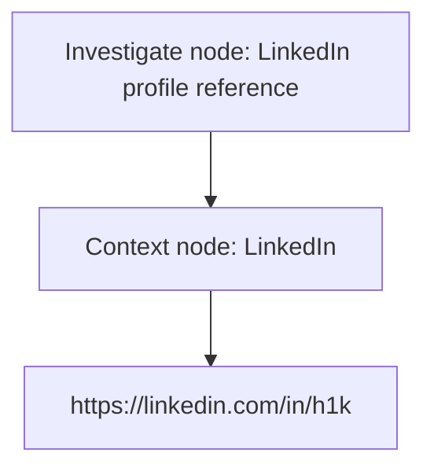

# Adam Bell Portfolio

Static portfolio website for Adam Bell, based in Portlaoise, Ireland.

## Files

- `index.html` — single-page static portfolio using Tailwind CSS via CDN.

## Verified source material used

- Name: Adam Bell
- Location: Portlaoise, Ireland
- LinkedIn URL: https://linkedin.com/in/h1k
- Website requirement: static portfolio
- Styling requirement: Tailwind CSS

## Context graph

The requested context node is linked to the investigation reference below.

### Context node

- Label: LinkedIn
- URL: https://linkedin.com/in/h1k
- Linked to: Investigate node

## Research constraint

LinkedIn profile content was not directly accessible during research, so the website does not list unverified employment history, education, skills, achievements, projects, or organisations.
